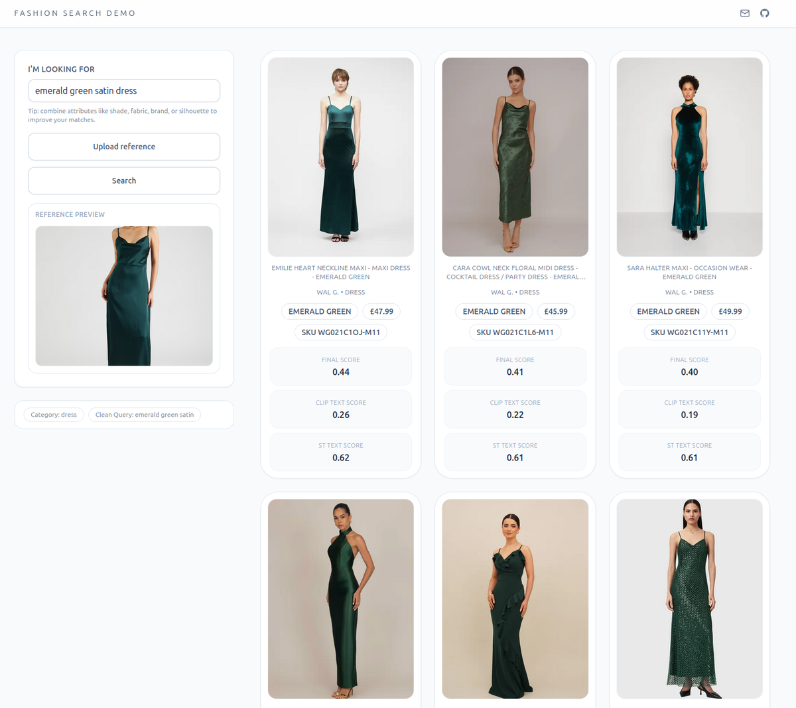

# Fashion Search Engine

A multimodal fashion search engine that lets you find clothing items using natural language queries or by uploading an image. Built with vector embeddings, it combines CLIP and Sentence Transformers to power semantic search across a catalog of fashion products.



## How to use

You can search for fashion items in three ways:
- **Text search**: Type something like "emerald green satin dress" or "Nike shoes under 50 pounds" and get relevant results
- **Image search**: Upload a reference image and find visually similar items
- **Combining the two**: the best option to get most precise results

## Features

- **Multimodal search**: Text and image queries supported
- **Smart filter extraction**: Uses OpenAI to parse natural language and extract structured filters (brand, category, color, price ranges)
- **Hybrid vector search**: Combines CLIP (for image/text) and Sentence Transformers (for text) embeddings for better results
- **PostgreSQL + pgvector**: Stores embeddings as vectors for fast similarity search
- **Web interface**: Basic, lightweight UI built with FastAPI and HTMX
- **Product scraper**: Includes a Zalando scraper to populate the corpus

## Stack

- **Backend**: FastAPI, Python 3.12+
- **Database**: PostgreSQL with pgvector extension (ran in local docker container)
- **ML Models**: 
  - CLIP (via open-clip-torch) for image and text embeddings
  - Sentence Transformers for text embeddings
- **AI**: OpenAI API for natural language filter extraction
- **Frontend**: Jinja2 templates, HTMX for dynamic updates, Tailwind CSS

## How it works

The engine works in a few stages:

1. **Query Processing**: LLM extracts structured "hard" filters (brand, category, color, price) and a "style query" (the descriptive parts like "satin" or "floral").

2. **Embedding Generation**: 
   - Text queries are encoded using both CLIP and Sentence Transformers
   - Image queries are encoded using CLIP

3. **Vector Search**: The system performs cosine similarity search against corpus embeddings stored in PostgreSQL.

4. **Result Ranking**: For text queries, it combines CLIP and Sentence Transformer scores with weighted averaging. For image queries, it compares against packshot (white background) and "on-person" images and takes the best match.

5. **Filtering**: Structured filters (brand, category, color, price) are applied as SQL WHERE clauses to narrow down results and ensure precision.

## Project Structure

```
.
├── src/
│   ├── app/           # FastAPI application
│   ├── search/        # Search engine logic (Engine, Query, Filters)
│   ├── embedding/     # Embedding generation (CLIP, Sentence Transformers)
│   ├── database/      # Database management and schemas
│   ├── lambda/        # Remote GPU job runner for corpus embedding
│   ├── scraper/       # Zalando product scraper
│   └── config.py      # Configuration and environment variables
├── frontend/          # Jinja2 templates and static files
├── docker/           # Docker configuration
├── scripts/          # Utility scripts
└── data/             # Scraped data (attributes, images)
```

## References

- [Learning Transferable Visual Models From Natural Language Supervision](https://arxiv.org/abs/2103.00020)
- [Sentence-BERT: Sentence Embeddings using Siamese BERT-Networks](https://arxiv.org/abs/1908.10084)
- [MiniLM: Deep Self-Attention Distillation for Task-Agnostic Compression of Pre-Trained Transformers](arxiv.org/abs/2002.10957)
- [laion/CLIP-ViT-B-16-laion2B-s34B-b88K](https://huggingface.co/laion/CLIP-ViT-B-16-laion2B-s34B-b88K)
- [all-MiniLM-L6-v2](https://www.sbert.net/)